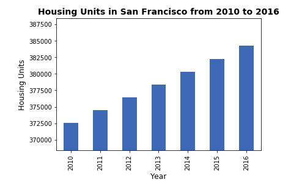

# San Francisco Rental Properties Analysis

*[San Francisco Park Reading by Juan Salamanca](https://www.pexels.com/photo/park-san-francisco-reading-61109/) | [Free License](https://www.pexels.com/photo-license/)*

## Background

A real estate team wants to trial initial offering with investment opportunities for the San Francisco market. If the new service is popular, then they can start to expand to other markets.

I have built a dashboard is to provide charts, maps, and interactive visualizations that help customers explore the data and determine if they want to invest in rental properties in San Francisco.

### Rental Analysis

The first step, built the dashboard to work out all of the calculations and visualizations in an rental analysis.

#### Housing Units Per Year

In rental_analysis.ipynb, I have calculated the number of housing units per year and visualize the results as a bar chart using the Pandas plot function.
Default Bar Chart

  
  
Bar Chart with y-axis limits adjusted

  

#### Average Gross Rent in San Francisco Per Year

I visualized the average gross rent per year to better understand the trends for rental income over time. I also visualize the average (mean) gross rent per year and visualized it as a line chart.

1. Calculated the mean `gross` for each year.
2. Visualized the mean gross rent per year as a line chart.

  

 

#### Average Sales Price Per Year

I determined the average sales price per year to better understand the sales price of the rental property over time. For example, a customer will want to know if they should expect an increase or decrease in the property value over time so they can determine how long to hold the rental property. I visualized the average (mean) `sales_price_sqr_foot` and visualized it as a bar chart.

1. Calculated the mean `gross` for each year.
2. Visualized the mean gross rent per year as a line chart.

  

#### Average Prices By Neighborhood

I compared the average prices by neighborhood.

1. Grouped the data by year and by neighborhood and calculate the average (mean) `sales_price_sqr_foot`.
2. Visualized the mean `sales_price_sqr_foot` per year with the neighborhood as a dropdown selector. Used hvplot to obtain the interactive dropdown selector for the neighborhood.
 
 

#### Top 10 Most Expensive Neighborhoods

I figured out which neighborhoods are the most expensive. by calculating the mean sale price for each neighborhood and then sort the values to obtain the top 10 most expensive neighborhoods on average. Plotted the results as a bar chart.

#### Parallel Coordinates and Parallel Categories Analysis

I used plotly express to create parallel coordinates and parallel categories visualizations so that investors can interactively filter and explore various factors related to the sales price of the neighborhoods.

Using the DataFrame of Average values per neighborhood (calculated above), created the following visualizations:

1. Create a Parallel Coordinates Plot
 
 

2. Create a Parallel Categories Plot

  

#### Neighborhood Map

I read in neighborhood location data and build an interactive map with the average prices per neighborhood. Used a scatter Mapbox object from plotly express to create the visualization.

  

### Dashboard

Created a new `dashboard.ipynb` for my dashboard code. Each function returns the plot figure in a format that Panel can use to plot the visualization.

  

